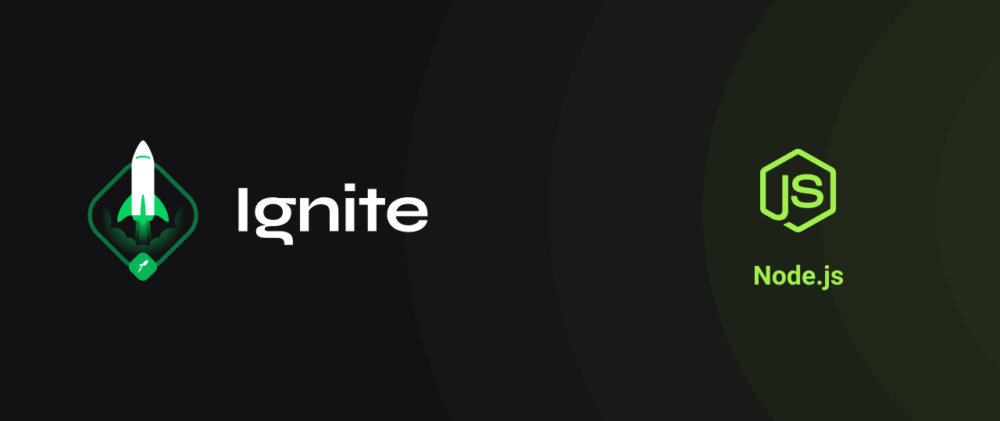

# 

## Sobre o projeto

Explorando os Fundamentos do Node.js para criar uma API REST completa, sem a necessidade de bibliotecas adicionais.

## Tecnologias

- [Serverless](https://www.serverless.com/)

## Instalação

```sh
yarn
```

## Comandos

```bash
# Criar projeto
$ yarn dev

```

## Contribuição

Contribuições são bem-vindas! Para contribuir, basta abrir uma issue ou pull request neste repositório.

## Autor

Feito por Mauricio Aires 👋🏽
